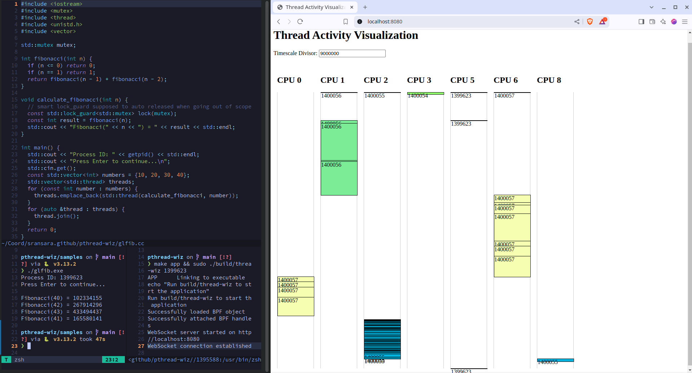

# Thread wiz

Visualize thread and process activity by using kernel tracepoints

## What is this?

This is a little utility that can have a live look into the activity of a running process' child threads and processes.



## How does it work?

By tracing linux kernel scheduler's context switch events. To implement tracing this utility uses [eBPF](https://ebpf.io/) capability of Linux kernels.

### Quick primer on eBPF

eBPF is a way to extend Linux kernel without using something like Kernel Modules. Kernel modules are great but enabling a kernel module requires restarting user machine and if there's a bug in a kernel module the whole system can crash. On the other hand eBPF runs in a sandboxed virtual machine (VM) within the kernel. So unlike kernel modules eBPF programs can by dynamically loaded and safely run without affecting the user system - layer of indirection saves the day. The main cons are because a virtual machine is running with focus on safety some capabilities will be limited (like no unbounded loops) and will be slightly slower than directly running without a VM.

### Why bother with hooking into kernel?

We could use tools that directly hook from user space into the kernel tracepoints, but having to constantly switch back and forth between user space and kernel space is not ideal when the purpose is to merely observe the system.

### What is the flow of data here?

1. [eBPF program](https://github.com/sransara/thread-wiz/blob/22169c994d55878cd783adf67dc2462982b3395c/bpf/thread_wiz.bpf.c) gets loaded into the kernel with a ceratin process ID to observe.
2. It hooks into [trace sched switch](https://github.com/torvalds/linux/blob/master/kernel/trace/trace_sched_switch.c) in the kernel. Event is formatted as:

```
❯ sudo cat /sys/kernel/debug/tracing/events/sched/sched_switch/format
[sudo] password for root:
name: sched_switch
ID: 311
format:
        field:unsigned short common_type;       offset:0;       size:2; signed:0;
        field:unsigned char common_flags;       offset:2;       size:1; signed:0;
        field:unsigned char common_preempt_count;       offset:3;       size:1; signed:0;
        field:int common_pid;   offset:4;       size:4; signed:1;

        field:char prev_comm[16];       offset:8;       size:16;        signed:0;
        field:pid_t prev_pid;   offset:24;      size:4; signed:1;
        field:int prev_prio;    offset:28;      size:4; signed:1;
        field:long prev_state;  offset:32;      size:8; signed:1;
        field:char next_comm[16];       offset:40;      size:16;        signed:0;
        field:pid_t next_pid;   offset:56;      size:4; signed:1;
        field:int next_prio;    offset:60;      size:4; signed:1;

print fmt: "prev_comm=%s prev_pid=%d ...
```

3. When an event happens, and if it is [related to the process being observed](https://github.com/sransara/thread-wiz/blob/22169c994d55878cd783adf67dc2462982b3395c/bpf/thread_wiz.bpf.c#L91), event data is buffered to the user space program.
4. A ring buffer is used to transfer data. This ring buffer is a memory mapped data structure with epolling for notifications [implemented in the kernel](https://www.kernel.org/doc/html/v6.6/bpf/ringbuf.html).
5. The user space program JSON serialize and copies events as they come through and writes to the `stdin` of a webserver ([websocket server](https://github.com/sransara/thread-wiz/blob/22169c994d55878cd783adf67dc2462982b3395c/web/server.go) written in go at the moment).
6. [Simple web page](https://github.com/sransara/thread-wiz/blob/22169c994d55878cd783adf67dc2462982b3395c/web/index.html) (that is a websocket client) turns the events into a boxes to be displayed live.

## How to run?

Requirements:

- Linux kernel 5.0+ for full eBPF support
- [libbpf](https://github.com/libbpf/libbpf) - is packaged in as a Git submodule to this repo as recommended
- clang - [to compile the eBPF objects](https://github.com/sransara/thread-wiz/blob/22169c994d55878cd783adf67dc2462982b3395c/Makefile#L17)
- C++ compiler
- boost-process as a system lib (used [at the moment](src/web_child.cc) for writing to `stdin` of the webserver)
- bpftool - supporting tool for [creating Linux kernel version independant eBPF headers](https://github.com/sransara/thread-wiz/blob/22169c994d55878cd783adf67dc2462982b3395c/Makefile#L43).

Clone repository with vendored submodules (libbpf):

```
git clone --recurse-submodules https://github.com/sransara/thread-wiz.git
```

```
make app
# for the moment run from project root because webserver reads fixed path ./web/index.html
# (need to run with eleveated privileges because we are even temporarily modifying the kernel process)
sudo ./build/thread-wiz <process to observe>
```

### Running a sample

Build:

```
make app
```

Run the process to observe, samples are written a way [that makes PID looks up easy:](https://github.com/sransara/thread-wiz/blob/22169c994d55878cd783adf67dc2462982b3395c/samples/slowfib.py#L21)

```
python samples/slowfib.py
# or
g++ -std=c++17 samples/glfib.cc -o glfib.exe
```

Start the observer program and webserver:
(need to run with eleveated privileges because we are even temporarily modifying the kernel process)

```
sudo ./build/thread-wiz
```

Open website running at http://localhost:8080/ (adjust the time divisor as necessary to see the boxes better)

Resume operation in the [sample program if necessary](https://github.com/sransara/thread-wiz/blob/22169c994d55878cd783adf67dc2462982b3395c/samples/slowfib.py#L22) to live observe thread and process activity on the webpage.

And if all went well we can see the Python Global Interpreter Lock in action while running compute intensive functions in threads (visualization from ./samples/slowfib.py).


And in comparison multiprocess based Python shows real parallelism in same compute intensive function (visualization from ./samples/procfib.py).


## TODO

Lots. TODO for the TODO.

1. Make sure all the requirements to build and run are capture and documented.
2. Remove dependency on external webserver and child process management.
3. Make better use of other trace events.
4. Visually show the reason for a context switch event.
5. ...
